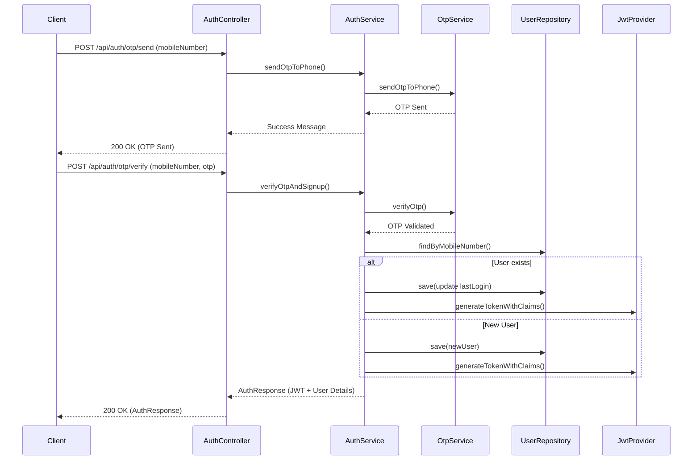

# Authentication Module

## Business Purpose
The Authentication module is responsible for identifying users, securely authenticating them via mobile numbers and OTPs (One Time Passwords), and issuing JSON Web Tokens (JWT) for stateless session management across the platform.

## Responsibilities
- Sending OTPs via SMS (Twilio).
- Verifying OTPs with limited attempts and expiration windows.
- Handling new user signups and returning user logins seamlessly in a single flow.
- Generating and validating JWT tokens.
- Securely logging users out by blacklisting JWTs.
- Updating user profile details (name, email) immediately after signup.

## Folder Structure
```text
com.stayo.stayo.auth
├── controller/
│   └── AuthController.java
├── dto/
│   ├── AuthResponse.java
│   ├── LogoutResponse.java
│   ├── OtpRequestDto.java
│   └── OtpVerifyRequestDto.java
├── entity/
│   └── BlacklistedToken.java
├── repository/
│   └── BlacklistedTokenRepository.java
├── security/
│   └── JwtProvider.java
├── service/
│   ├── AuthService.java
│   └── OtpService.java
└── util/
    └── AuthUtil.java
```

## Data Flow & Architecture

### Sequence Diagram: OTP Login Flow



## Public APIs
- **POST `/api/auth/otp/send`**: Initiates OTP dispatch.
- **POST `/api/auth/otp/verify`**: Verifies OTP and returns JWT token.
- **PUT `/api/auth/update-details`**: Updates name and email. Marks `profileCompleted` as true. Requires JWT.
- **POST `/api/auth/logout`**: Invalidates the current JWT token. Requires JWT.

## Entities
- **BlacklistedToken**: Stores invalidated JWT tokens to prevent reuse before expiration.
- *(Note: OTP entities reside in `user.entity.OtpRequest` and User resides in `user.entity.User`, showing tight coupling with User module).*

## Services
- **AuthService**: Orchestrates authentication logic (OTP sending, verification, user lookup/creation, token generation, user detail updates, and logout token blacklisting).
- **OtpService**: Manages OTP generation, tracking attempts, expiration (5 mins), and communication with Twilio (`SmsService`). Uses static OTP (`123456`) in dev environments.

## Validation & Exception Handling
- **Validations**: Strict E.164 format validation for mobile numbers (`^\+[1-9]\d{1,14}$`).
- **Exceptions**: 
  - `InvalidMobileNumberException`
  - `OtpNotFoundException`, `OtpExpiredException`, `InvalidOtpException`, `MaxOtpAttemptsExceededException` (max 3 attempts).
  - `UserNotFoundException`
  - `InvalidTokenException`

## Security
- **JWT**: Stateless. Contains `userId`, `name`, `email`, and `mobileNumber` as claims.
- **Logout Strategy**: Token Blacklisting. Valid tokens are stored in the database's `BlacklistedToken` collection upon logout until their natural expiration.
- **OTP Protection**: Max 3 attempts allowed before OTP deletion, preventing brute force. 

## Known Limitations
- The OTP request entity (`OtpRequest`) currently resides in the `user` module rather than the `auth` module, violating strict modular boundaries.
- No rate limiting on `/otp/send` endpoint beyond basic OTP record deletion.

## Future Improvements
- Implement Redis for caching Blacklisted Tokens and OTPs instead of MongoDB to improve speed.
- Implement strict IP-based rate limiting on the OTP sending endpoint.
- Refactor `OtpRequest` to reside natively in the `auth` module.
