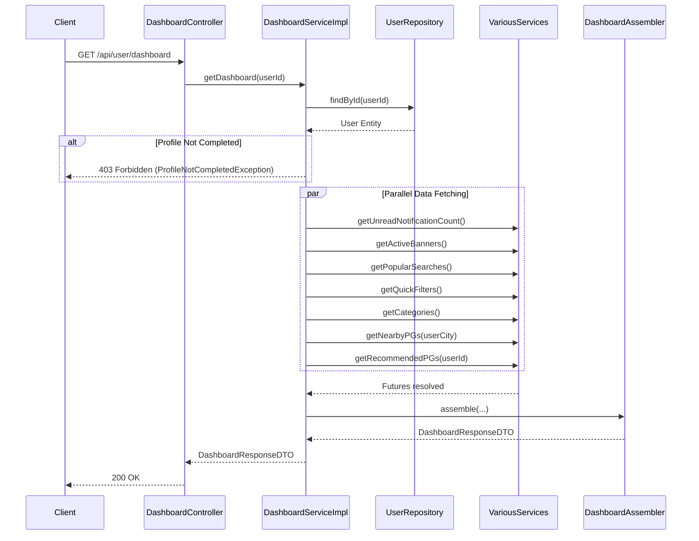

# Dashboard Module

## Business Purpose
The Dashboard module acts as the central hub and entry point for users after they log in. It provides an aggregated view of various components required to discover PGs, such as nearby properties, recommended properties, search categories, quick filters, banners, and unread notifications.

## Responsibilities
- Act as an internal API Gateway/Aggregator by orchestrating calls to multiple other services (`ContentService`, `PropertyService`, `SearchService`, `NotificationService`).
- Enforce business rules, such as preventing dashboard access if a user's profile is incomplete.
- Assemble complex nested DTOs into a single cohesive response for the frontend to render the Home Screen efficiently.
- Ensure high performance (sub-150ms) by fetching independent data components in parallel.

## Folder Structure
```text
com.stayo.stayo.dashboard
├── assembler/
│   └── DashboardAssembler.java
├── controller/
│   └── DashboardController.java
├── dto/
│   └── DashboardResponseDTO.java
└── service/
    ├── DashboardService.java
    └── impl/
        └── DashboardServiceImpl.java
```

## Data Flow & Architecture

### Sequence Diagram: Load Dashboard



## Public APIs
- **GET `/api/user/dashboard`**: Returns the aggregated `DashboardResponseDTO` containing user summary, search defaults, popular searches, banners, quick filters, categories, nearby PGs, and recommended PGs.

## Internal APIs & Dependencies
The `DashboardServiceImpl` heavily relies on:
- `UserRepository` (User module)
- `NotificationService` (Notification module)
- `BannerService`, `PopularSearchService`, `QuickFilterService`, `CategoryService` (Content module)
- `NearbyPGService`, `RecommendationService` (Property module)

## DTOs & Assemblers
- **DashboardResponseDTO**: The massive aggregated object sent to the frontend. Contains no raw entities.
- **DashboardAssembler**: A dedicated component responsible for mapping entities (like `Banner`, `QuickFilter`, `PG`, `User`) into their respective DTOs (`BannerDTO`, `QuickFilterDTO`, `PGCardDTO`, `UserSummaryDTO`) and constructing the final `DashboardResponseDTO`.

## Validation & Exception Handling
- `UserNotFoundException`: If the JWT user ID doesn't exist in DB.
- `ProfileNotCompletedException`: Thrown if `user.isProfileCompleted()` is false. This forces the frontend to redirect the user to the profile completion screen before they can see the dashboard.

## Performance
- **Parallel Execution**: Uses `CompletableFuture.supplyAsync()` to fetch Notifications, Banners, Searches, Filters, Categories, Nearby PGs, and Recommended PGs concurrently. `CompletableFuture.allOf().join()` ensures the thread waits for all fetches to complete before assembly. This drastically reduces response time compared to sequential fetching.

## Known Limitations
- Heavy inter-module coupling at the service layer.
- Some data points in the `DashboardAssembler` (e.g., `verified=true`, `distance="1.2 km"`, `availableBeds=2`, `ownerVerified=true`) are currently mocked and need real implementations from the Property/Search modules.

## Future Improvements
- Implement Redis caching for static dashboard components (Banners, Categories, Popular Searches, Quick Filters) to prevent unnecessary DB queries on every dashboard load.
- Remove mocked data fields in `PGCardDTO` assembly by fetching actual distance and occupancy data.
