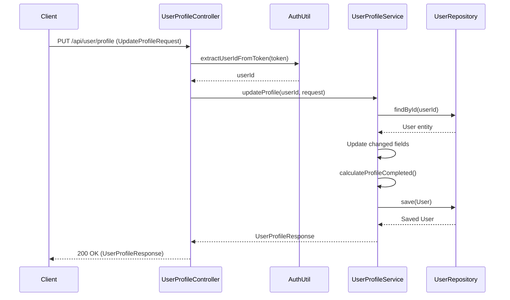

# User Module

## Business Purpose
The User module manages everything related to the user's identity, profile details, and preferences on the StayO platform. It stores personal information, professional information, and handles profile image uploads. It also calculates profile completion percentages which can be used to incentivize users to provide more information.

## Responsibilities
- Retrieving basic user details for the currently logged-in user.
- Fetching and updating extended user profiles.
- Handling profile image uploads and local storage management.
- Tracking profile completion status automatically based on filled fields.
- Maintaining a list of wishlist property IDs.

## Folder Structure
```text
com.stayo.stayo.user
├── controller/
│   ├── UserController.java
│   └── UserProfileController.java
├── dto/
│   ├── UpdateProfileRequest.java
│   ├── UpdateUserDto.java
│   ├── UserProfileResponse.java
│   ├── UserResponseDto.java
│   └── UserSummaryDTO.java
├── entity/
│   ├── OtpRequest.java
│   ├── Role.java
│   └── User.java
├── repository/
│   ├── OtpRepository.java
│   └── UserRepository.java
└── service/
    └── UserProfileService.java
```

## Data Flow & Architecture

### Sequence Diagram: Update User Profile



## Public APIs
- **GET `/api/users/me`**: Fetches basic information for the currently authenticated user.
- **GET `/api/user/profile`**: Fetches the extended profile of the user, including completion percentage.
- **PUT `/api/user/profile`**: Updates the extended profile of the user.
- **POST `/api/user/profile/image`**: Uploads a profile image as `multipart/form-data`.
- **DELETE `/api/user/profile/image`**: Deletes the user's profile image and removes the file from local storage.

## Entities
- **User**: The central document in the `users` collection. Contains basic info, personal info, professional info, address, wishlist property IDs, role, and audit timestamps.
- **Role**: Enum (`USER`, `OWNER`, `ADMIN`).
- **OtpRequest**: Tracks OTP requests for login/signup (Note: This is functionally related to Authentication but physically stored in the `user` module).

## Services
- **UserProfileService**: 
  - Retrieves and maps users to response DTOs.
  - Handles updates to all profile fields.
  - Dynamically calculates the completion percentage (out of 12 fields) and boolean `profileCompleted` status.
  - Manages image uploads to a local `uploads` directory, ensuring old images are deleted when a new one is uploaded to prevent orphaned files.

## Repositories
- **UserRepository**: Spring Data MongoDB repository for the `users` collection.
- **OtpRepository**: Tracks OTP generation, expiry, and attempts.

## Validation & Exception Handling
- `UserNotFoundException`: Thrown when extracting a `userId` from a JWT that no longer exists in the database.
- File Upload Validation: Ensures the `MultipartFile` is not empty and attempts to securely save it locally.

## Security
- All endpoints extract the `userId` natively from the `Authorization` header JWT token via `AuthUtil`, meaning users can only ever access or modify their own data.

## Known Limitations & Technical Debt
- **Local Image Storage**: Profile images are currently stored directly on the local filesystem (`uploads/` directory). This is not scalable for multi-instance deployments.
- **Module Coupling**: `OtpRequest` and `OtpRepository` reside in the User module instead of the Auth module.

## Future Improvements
- Migrate profile image storage to a cloud provider like AWS S3, Google Cloud Storage, or Cloudinary.
- Decouple `OtpRequest` from the user module.
